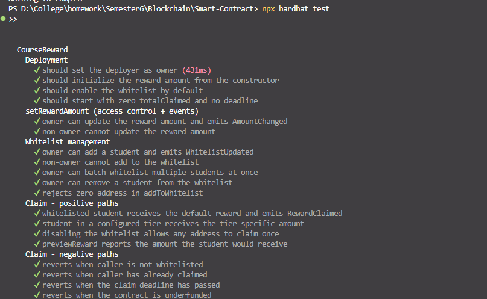
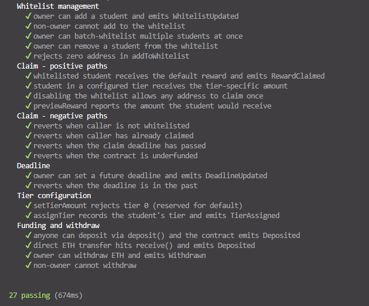
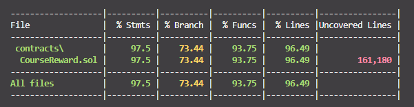
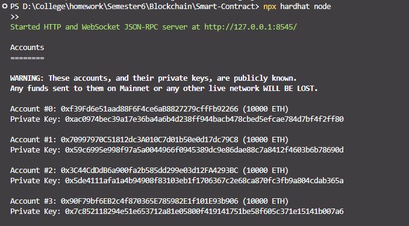
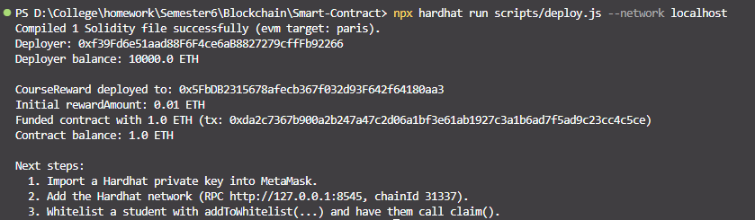
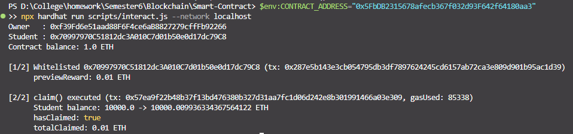
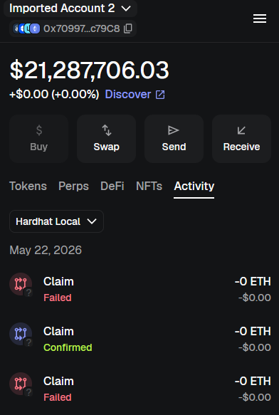
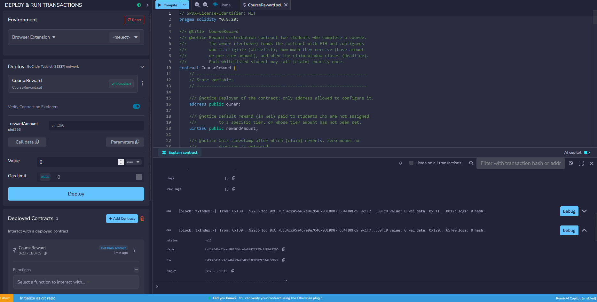

# Course Reward System

## Deskripsi

Smart contract sederhana yang dipakai dosen untuk membagikan **reward
dalam bentuk ETH** kepada mahasiswa yang sudah menyelesaikan sebuah
course. Dosen (owner) mendanai contract, mendaftarkan mahasiswa ke
whitelist, dan menentukan besar reward — termasuk **tier khusus** dan
**deadline klaim**. Setiap mahasiswa yang memenuhi syarat dapat
memanggil `claim()` **tepat satu kali** untuk menerima reward-nya.

Project ini dikerjakan untuk **Project 2 — Smart Contract** mata kuliah
Blockchain (Modul 07–11). Stack: **Solidity 0.8.20 + Hardhat + ethers
v6**, dengan unit test komprehensif dan script deployment ke local
Hardhat network.

## Anggota Kelompok

- Nathan Kho Pancras 5027231002
- Michael Kenneth Salim 5027231008 
- Fico Simhanandi 5027231030


## Fitur

### Fitur Wajib

- **Owner set reward amount** — `setRewardAmount(uint256)` (hanya
  owner).
- **Mahasiswa claim sekali** — `claim()`, dijaga oleh mapping
  `hasClaimed`.
- **Tracking** — `hasClaimed`, `totalClaimed`, dan `getBalance()` untuk
  audit on-chain.
- **Event logging** — `RewardClaimed`, `AmountChanged`,
  `WhitelistUpdated`, `DeadlineUpdated`, `TierAssigned`,
  `TierAmountSet`, `WhitelistToggled`, `Deposited`, `Withdrawn`.

### Fitur Bonus

- **Whitelist mahasiswa** — `addToWhitelist`, `addManyToWhitelist`,
  `removeFromWhitelist`. Whitelist bisa di-toggle on/off via
  `setWhitelistEnabled(bool)`.
- **Deadline claim** — `setDeadline(uint256)`. Setelah deadline
  terlewati, `claim()` revert.
- **Multiple reward tiers** — `setTierAmount(uint8, uint256)` dan
  `assignTier(address, uint8)`. Tier 0 dipakai sebagai default
  (memakai `rewardAmount`).

### Komponen Smart Contract

| Komponen        | Jumlah | Detail                                                                                                |
| --------------- | ------ | ----------------------------------------------------------------------------------------------------- |
| State variables | 5      | `owner`, `rewardAmount`, `claimDeadline`, `totalClaimed`, `whitelistEnabled`                          |
| Mappings        | 4      | `hasClaimed`, `whitelist`, `studentTier`, `tierAmount`                                                |
| Functions       | 13     | `setRewardAmount`, `setDeadline`, `setWhitelistEnabled`, `addToWhitelist`, `removeFromWhitelist`, `addManyToWhitelist`, `setTierAmount`, `assignTier`, `withdraw`, `claim`, `getBalance`, `previewReward`, `deposit` |
| Modifiers       | 2      | `onlyOwner`, `beforeDeadline`                                                                         |
| Events          | 9      | `RewardClaimed`, `AmountChanged`, `WhitelistUpdated`, `WhitelistToggled`, `TierAssigned`, `TierAmountSet`, `DeadlineUpdated`, `Deposited`, `Withdrawn` |

## Struktur Project

```
Smart-Contract/
├── contracts/
│   └── CourseReward.sol        # Smart contract utama
├── test/
│   └── CourseReward.test.js    # 27 unit test (Deployment, Positive,
│                               # Negative, Access Control, Events)
├── scripts/
│   ├── deploy.js               # Deploy + fund di local network
│   └── interact.js             # Demo whitelist + claim
├── hardhat.config.js
├── package.json
├── .gitignore
└── README.md
```

## Cara Menjalankan

### Prerequisites

- Node.js v18+ (disarankan v20 LTS)
- npm (sudah terpasang bersama Node)
- MetaMask (browser extension) untuk demo interaksi

### Installation

```bash
npm install
```

### Compile

```bash
npx hardhat compile
```

### Test

```bash
npx hardhat test
```

Coverage (opsional, butuh plugin yang sudah ter-include di
`@nomicfoundation/hardhat-toolbox`):

```bash
npx hardhat coverage
```

### Deploy (Local)

Jalankan local node di terminal pertama:

```bash
npx hardhat node
```

Di terminal kedua, deploy dan funding contract:

```bash
npx hardhat run scripts/deploy.js --network localhost
```

Output script akan menampilkan **contract address** — simpan untuk
langkah berikutnya.

### Interaksi via script (opsional)

Script `interact.js` melakukan dua transaksi otomatis (whitelist + claim)
sebagai sanity check sebelum demo MetaMask:

```powershell
# PowerShell
$env:CONTRACT_ADDRESS="0x..."
npx hardhat run scripts/interact.js --network localhost
```

### Interaksi via MetaMask

1. Buka MetaMask → **Add network manually**:
   - Network name: `Hardhat Local`
   - RPC URL: `http://127.0.0.1:8545`
   - Chain ID: `31337`
   - Currency symbol: `ETH`
2. **Import account** menggunakan salah satu private key yang ditampilkan
   oleh `npx hardhat node` (account #0 adalah owner).
3. Gunakan tool seperti [Remix](https://remix.ethereum.org/) (mode
   "Injected Provider - MetaMask") atau script `interact.js` untuk
   memanggil fungsi-fungsi contract.
4. Untuk demo:
   - Owner memanggil `addToWhitelist(<alamat mahasiswa>)`.
   - Mahasiswa (account lain) memanggil `claim()` dan menerima ETH.

## Contract Address

Hasil deploy ke Hardhat local muncul di terminal, contoh:

```
CourseReward deployed to: 0x5FbDB2315678afecb367f032d93F642f64180aa3
```

Ganti dengan address dari deployment Anda sebelum submit.

## Screenshots


 

 

 

 

 

 

 



## Catatan Pengembangan

- **Reentrancy** — `claim()` mengikuti pola
  *checks-effects-interactions*: `hasClaimed[msg.sender] = true` dipasang
  **sebelum** transfer ETH, sehingga upaya re-entry akan ditolak oleh
  guard `!hasClaimed[msg.sender]`.
- **Gas** — Optimizer Solidity dinyalakan di `hardhat.config.js` (runs:
  200).
- **Funding** — Contract menerima ETH melalui `deposit()` maupun
  `receive()` (transfer langsung), dan owner dapat menarik sisa saldo
  dengan `withdraw(uint256)`.
